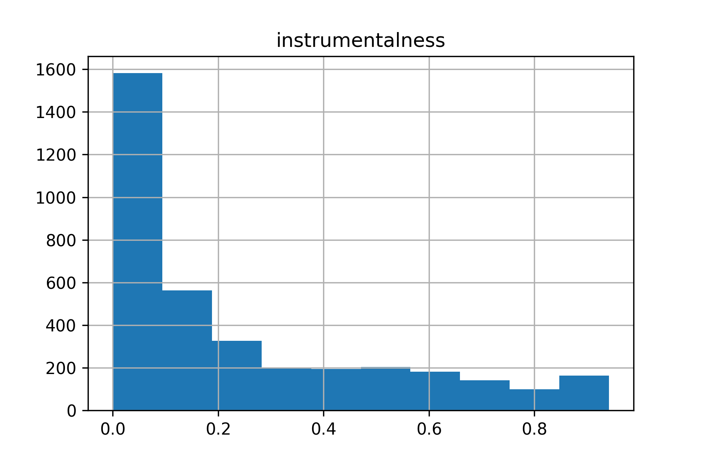
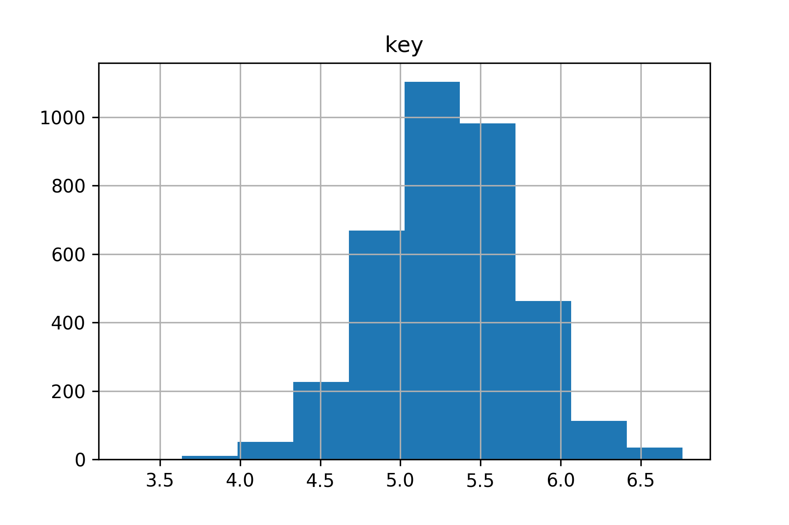
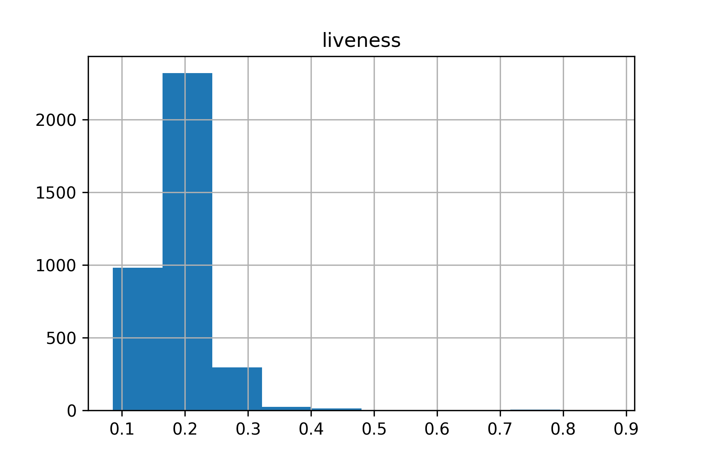
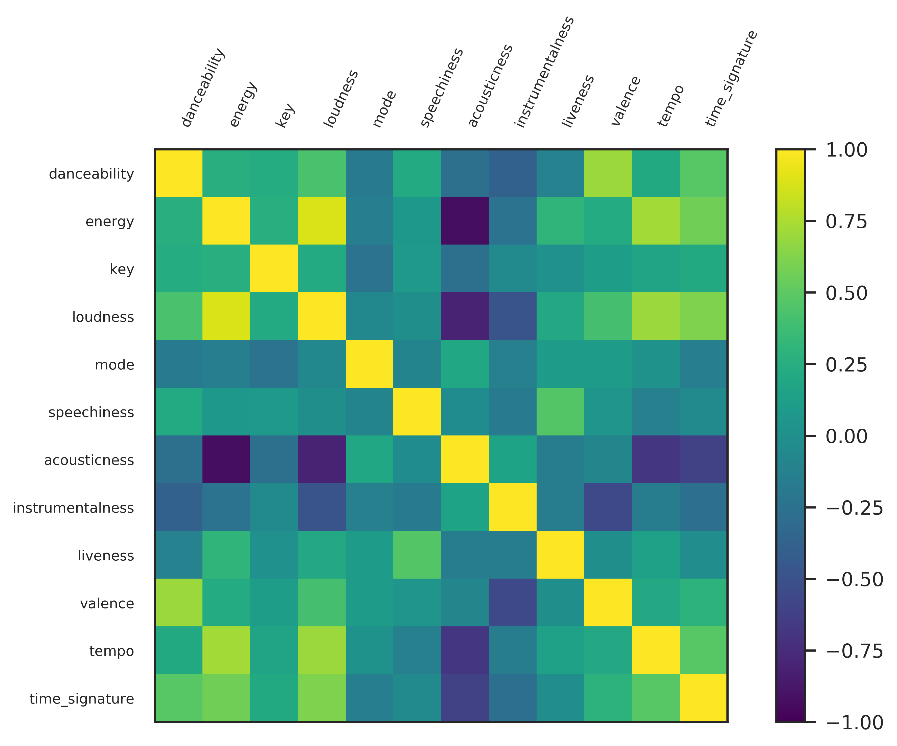
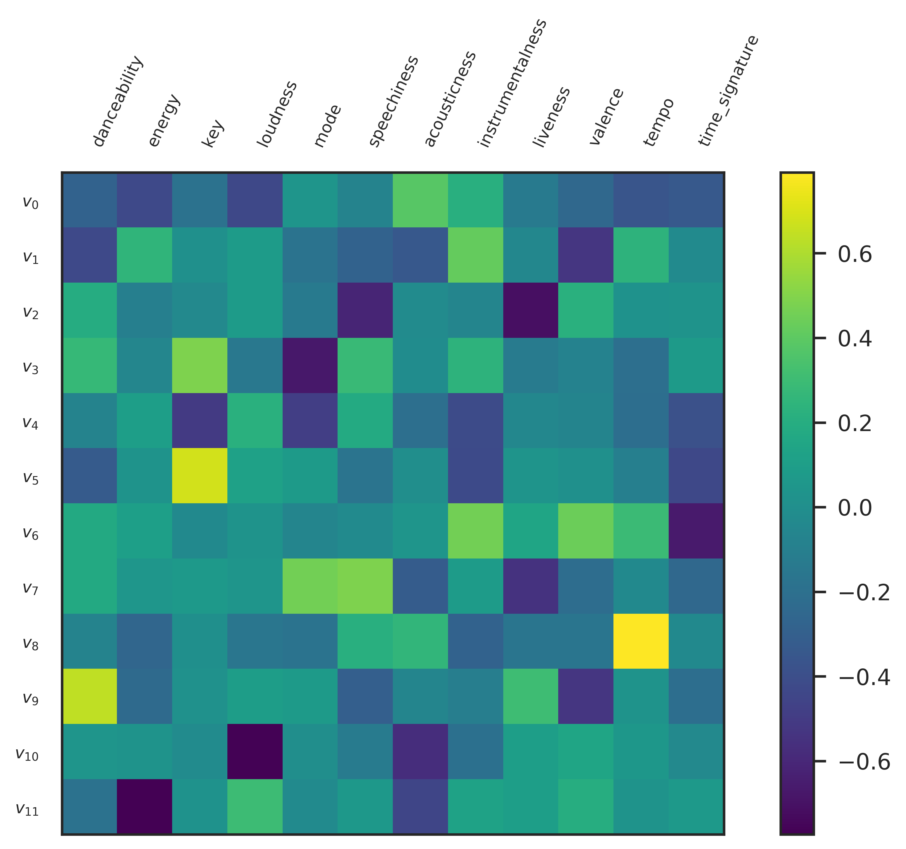
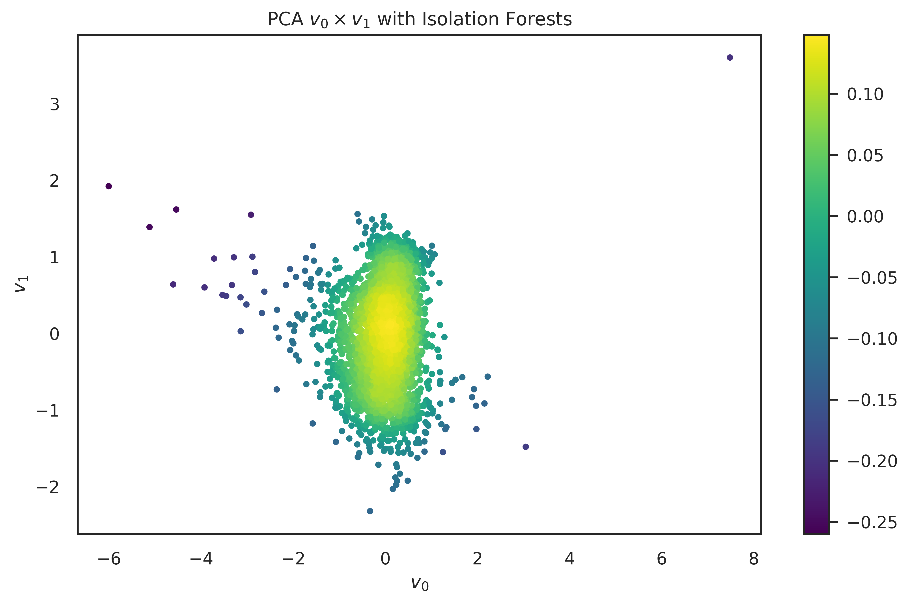
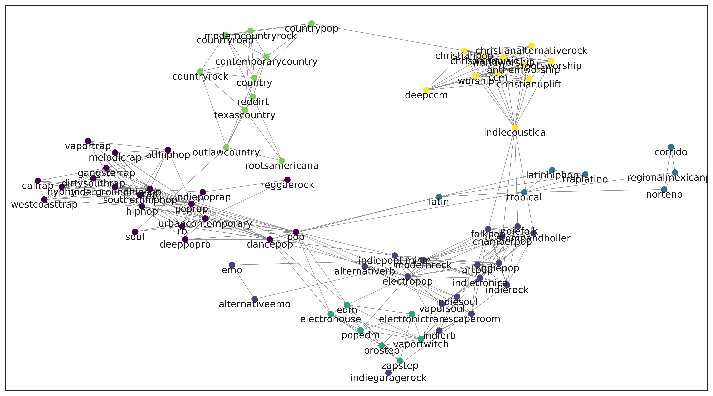
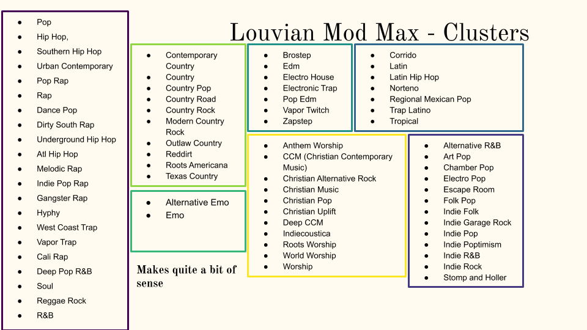
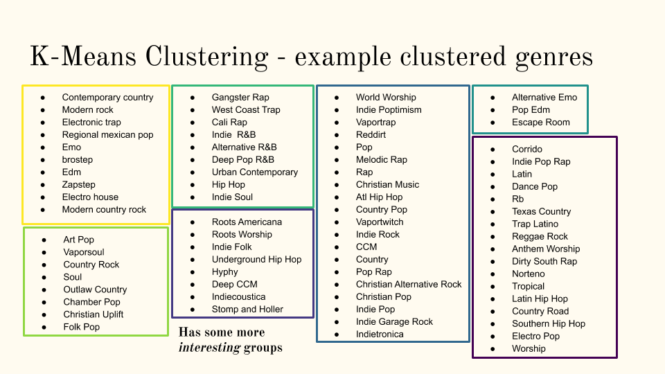

# Subgenere Analysis of *Every Noise*

## Abstract

The purpose of the project is to analyze the connectedness and features of different musical subgenres from Spotify. 

Genres of music
can be represented and quantified in many ways. In this work we
build a network based on connected genres at the website [everynoise](http://everynoise.com).
We compare the genres deemed as similar according to this website to genres found to be similar through K-Means clustering using audio features such as danceability, valence, and tempo via the Spotify API. 
In addition to this a network was constructed based on the connection of genres on the above website and perform graph partitioning on. We limited our graph to include only relevant nodes in order to better understand any patterns which might arise ( and for performance's sake)
To do this, we took genre rankings from each school in the US and
combined these to get the top 75 genres according to university students across the US. We then
compared the communities generated on a graph which included only these popular genres using both
methods to glean insights into the genres which are most popular
in U.S. Schools, and to see if we can understand better the way that
musical features influence genre.

---

## Intruduction

Understanding similarities between musical genres would be very useful in building a recommendation system. If we can more generally categorize genres into larger groups, it may be easier to have a system which provides a desired amount of variability while still exposing users to music which they would find enjoyable. Making smart, relevant recommendations is of great interest to many large corporations including Apple Music, Spotify, Pandora, and more.

Also, if we are able to quantify the classification and clustering of genres, we may also be able to expand this to the analysis of similar artists, which would lead to better recommendations and insights as well.

Furthermore, it is of personal interest to see which musical features are relevant to which subgenres, and which genres are similar according to these features. Perhaps through exploring and grouping these genres we can better understand some genres and what makes them unique, or what connects them to other genres.

---

## Data

### Description

Our data was sourced from the website [everynoise](http://everynoise.com). This website provides the names and associated genres for over $3000$ subgenres which exist on Spotify. Furthermore, for each genre, it provides the associated genres which it deems most similar to the given genre. It also provides a sample playlist for each genre with examples of popular representative songs which belong to this genre. We used this playlist to generate musical features for each subgenre, by taking the average features of each song in the sample playlist. 

We also made use of data from a specific subsection of the website [Every School at Once](http://everynoise.com/everyschool.cgi) where the top subgenres for each university in the world are listed. To keep matters a bit more local, we narrowed the universities down to just those in the United States. This allows us to analyze data that is more relevant to our target audience for this project.

### Collection Methods

We used a Python webscraper using BeautifulSoup to get the html data from the website, then parsed this data and created csv files with the information which we found to be relevant to our research. This included every name of each subgenre, the genres listed as most similar to this genre, and their weights (some genres are more *similar* than to other similar genres). Also, we performed the same process to get the ranking of genres for each university in the US.

To get the musical features, we used Spotify's API. For each subgenre, we got each track in its associated playlist and took an average of the musical features for all the tracks in this playlist with the idea that this average can be a representation of the average musical features for this subgenre.

---

## Exploratory Results

Through the Spotify API we averaged the features for each subgenres' playlist and took the mean of each feature per playlist. The distributions are as follows for a selection of the features:

Some of these are clearly more interesting than others, and many other features are skewed such as *instrumentalness*.

Correlation Heatmaps are a great way to get a brief concensus on the relationships between the features of data.

Here is a table of a select few relationships

|   Feature 1  | Feature 2     | Correlation Coefficient |
|:------------:|---------------|-------------------------|
| Danceability | Valence       | 0.70                    |
| Energy       | Tempo         | 0.73                    |
| Energy       | Loudness      | 0.88                    |
| Energy       | Acousticness  | -0.90                   |
| Loudness     | Accousticness | -0.81                   |

Using the information gained from looking at the distributions and correlations of features in conjunction to Principal Component Analysis, we decided to limit our dimensions to the following:
* Energy
* Average of Dancability and Valence
* Mode
* Key
* Tempo

---

## Methodology: Design and Techniques

PCA reduces the feature vectors for each subgenre $g_i \in \mathbb{R}^{12}$ into $12$ eigenvectors. These eigenvectors indicate the principle `directions' of the data. 
Each feature was standardized using $Z$-score normalization.
The folowing figure is the Eigenvector-Feature heatmap.

From here we can see that:
* $v_5$ represents $key$ positively
* $v_8$ represents $tempo$ positively
* $v_9$ represents $danceability$ positively

In addition the prjoection of the the features and data against eigenvectors $v_i$ and $v_j$ give the following figures. Isolation Forest Outlier Detection is useful to find the subgenres that are not following the eigenvectors.

For the Every Schools dataset, we took only the Universities in the United States and attempted to find the top $75$ genres via Spring Rank, PageRank, and Modified Borda Count. Please feel free to visit the PDF for more information about those.

Once those subgenres were gathered, Louvain Modularity Maximization and K-Means were applied to discover genres from those top $75$ subgenres.

In a more readable form:

And from K-Means

---

## Conclusion

The clusters identified using Louvain Modularity Maximization were clusters which would appear to make more intuitive sense to a human. The subgenres clustered together using this method tended to appear to actually represent a higher overarching genre, or parent genre.

However, the clusters identified using K-means are quite interesting. They show that there may be some unidentified musical similarities between different genres, and this could be useful when developing targeted recommendations. 